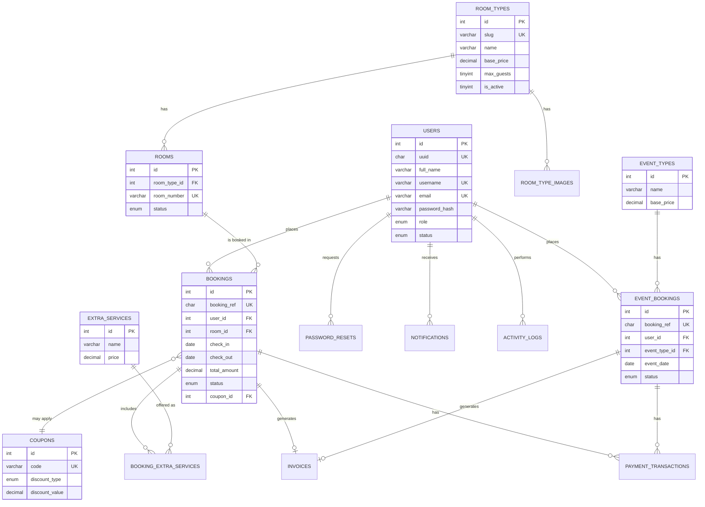

# Database Design

Full DDL: [`database/migrations/001_create_schema.sql`](../database/migrations/001_create_schema.sql).
Demo data: [`database/seeds/seed.sql`](../database/seeds/seed.sql).

## What changed from the original schema

| Original | Problem | Rebuilt as |
|---|---|---|
| 9 separate tables (`classic`, `superior`, `club`, `delux`, `superdelux`, `family`, `luxury`, `presidential`, `bachelor`), each with an `Availability` int flag | Adding a room category meant creating a new table; booking code had to build SQL with string-interpolated table names; no way to query "all rooms" in one statement | `room_types` (the category) + `rooms` (physical units), a standard 1:N relation |
| `signup` table with a plaintext `password` column | Full account takeover if the DB ever leaked; also compared with `==` in PHP, so type-juggling bugs were possible | `users.password_hash`, bcrypt via `password_hash()`/`password_verify()` |
| No roles — a second, separate hardcoded admin login lived in PHP code (`success.php`) | Two auth systems to maintain; no way to have a receptionist role with narrower access | `users.role` ENUM (`super_admin`/`admin`/`receptionist`/`customer`) — one auth system, everything gated by middleware |
| `room` table (bookings) with a `Total` column populated from client-submitted `$_POST['Total']` | A booking's price could be tampered with client-side before submission | `bookings.total_amount` is only ever set by `BookingService::calculatePricing()`, computed server-side from `room_types.base_price` + `extra_services` + `coupons` + `settings.tax_rate_percent` |
| No availability logic beyond "loop over Availability=1 rows" with no locking | Race condition: two concurrent bookings could both read `Availability=1` before either UPDATE landed, double-booking the room | `SELECT ... FOR UPDATE` row-locking inside a transaction in `BookingService::createRoomBooking()`, checked against actual date-range overlaps |
| No indexes beyond primary keys, no foreign keys | Slow lookups at scale, no referential integrity (a deleted room type would silently orphan its bookings) | Foreign keys with explicit `ON DELETE` behavior (`CASCADE` for genuinely dependent rows like `room_type_images`, `SET NULL` where a booking should survive its user being deleted, `RESTRICT` where deleting would corrupt financial records) + indexes on every foreign key and frequently-filtered column (`status`, `check_in`/`check_out`, etc.) |

## Entity-relationship diagram



## Booking status lifecycle

Room bookings (`bookings.status`) and event bookings (`event_bookings.status`)
follow a controlled state machine — the admin UI only ever exposes the valid
next actions for a booking's current state (see
`App\Controllers\Admin\BookingController::VALID_TRANSITIONS`):

```
pending → confirmed → paid → checked_in → checked_out
   |           |         |
   └────→ rejected   cancelled
```

## Why UUIDs on `users` but auto-increment everywhere else

The brief asked about UUID/ULID "where it makes sense." `users.uuid` exists
as a stable, non-guessable public identifier (useful if you ever expose a
user-facing API or want to avoid leaking sequential user counts). Internal
foreign keys still use auto-increment integers, because for a single-database
application, integer joins are faster and simpler to reason about than UUID
joins — UUIDs earn their cost mainly in distributed/multi-database systems
or when IDs are generated client-side before an INSERT, neither of which
applies here. `bookings.booking_ref` and `event_bookings.booking_ref` are the
public-facing identifiers guests and staff actually use (e.g. `BK-8F3A2C1D`),
which serves the same "don't leak sequential IDs" goal for the objects
guests actually see, without paying the UUID join cost on the tables that
matter most for query volume.
